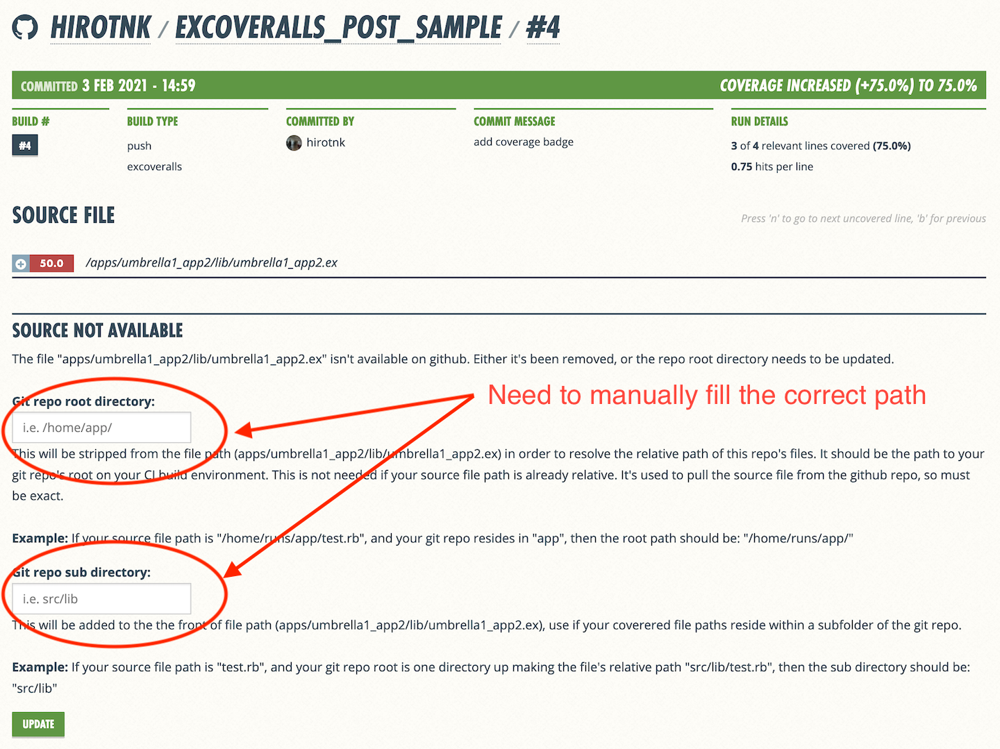

# excoveralls_post_sample
[](https://coveralls.io/github/hirotnk/excoveralls_post_sample?branch=master)

This repository shows how [ExCoveralls](https://github.com/parroty/excoveralls)' `coveralls.post` options (currently by [PR](https://github.com/parroty/excoveralls/pull/244)) can be used to run CI jobs when we have multiple umbrella projects under a repo.

## Two problems for a repo with multiple umbrella projects

### Line by line coverage does not show up
Paths to source files are different for each umbrella project, and detailed coverages for files do not show up on Coveralls UI. To solve this issue, you can use `--subdir <path>` and `--rootdir <path>` options.



### Want to use same build number for all umbrella projects coverage
We want to bundle all coverages for each umbrella project in a single build.
For example, we execute following mix coveralls.post under one umbrella project with `--parallel true`:
```
cd umbrella1

MIX_ENV=test mix coveralls.post --umbrella --token $TOKEN --build $BUILD_NUM --sha $GIT_COMMIT --parallel true --subdir "umbrella1/" --branch "master" --name "local host" --message $GIT_COMMIT_MSG
```

Then we execute another mix coveralls.post under another umbrella project with `--parallel true`:
```
cd ../umbrella2
MIX_ENV=test mix coveralls.post --umbrella --token $TOKEN --build $BUILD_NUM --sha $GIT_COMMIT --parallel true --subdir "umbrella2/" --branch "master" --name "local host" --message $GIT_COMMIT_MSG
```

Finally, we report the results with following:
```
curl -k https://coveralls.io/webhook\?repo_token\=$TOKEN -d "payload[build_num]=$BUILD_NUM&payload[status]=done"
```
We can use the same `$BUILD_NUM` for all umbrella projects using mix coveralls.port `--build <build_num>` option.
